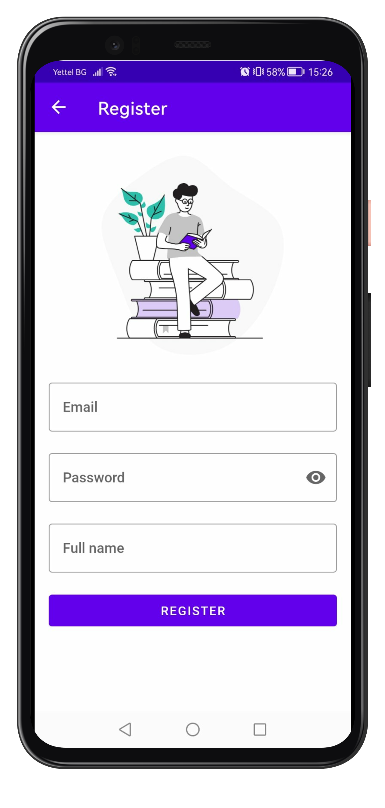
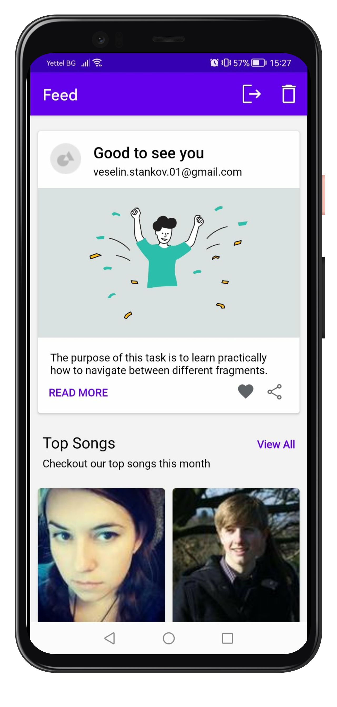
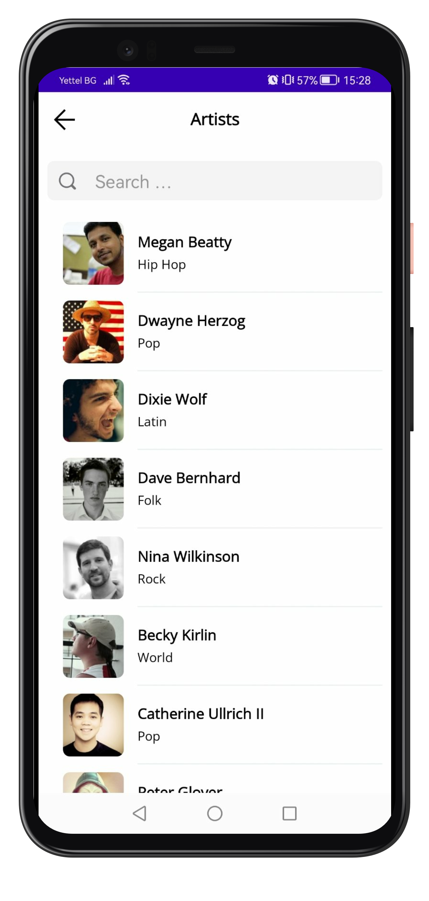

# MusicArtistsAndoirdApp

  

This is an Android application that I have build with the purpose of learning the basics of Android using Kotlin.

The app is built using the Model - View - Presenter (MVP) architecture pattern.
It uses a Room database to store the details of every user after registration.
I have implemented dependency injection, using Hilt.
All of the data in the application is "dummy". It is fetched from here. - https://mockapi.io
The application combines most of the basic and fundamental features in Android.

The app consists of several screens, including a login/register mechanism,
a feed screen with implemented pagination and a song/artist details screen.
